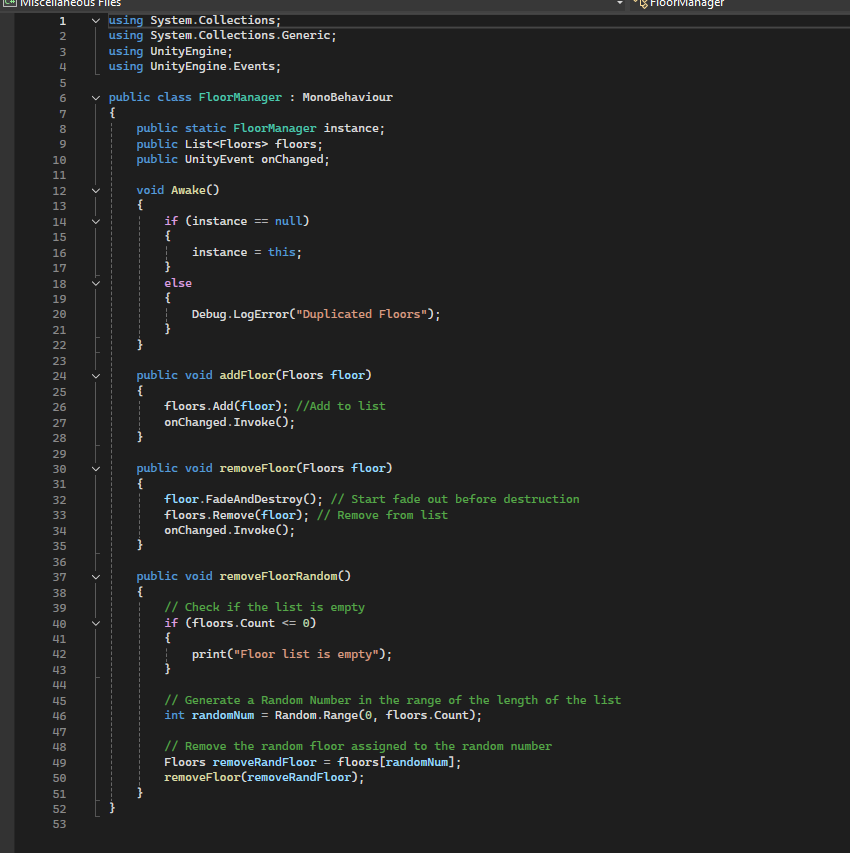

# Challenge-06
Advanced Project Mini Game
For today's project we will be creating a mini game where we will implement everything we have learned in order to make it playable.
1. First we import the assets using the package manager and install the probuilder tool.
   
2. We create the stage and add the playable character to the scene.
   
3. We add movement and shooting to the player.
   
4. Then we added the enemy spawners to all 4 corners.
    
5. We make the walls able to detect collisions with the bullets.
   
6. Then we make the floors have a box collider and a script Floors, along with a FloorManager that will be in charge of removing floors from the list.
   
   
   
8. Finally we add the rain to make it harder.

